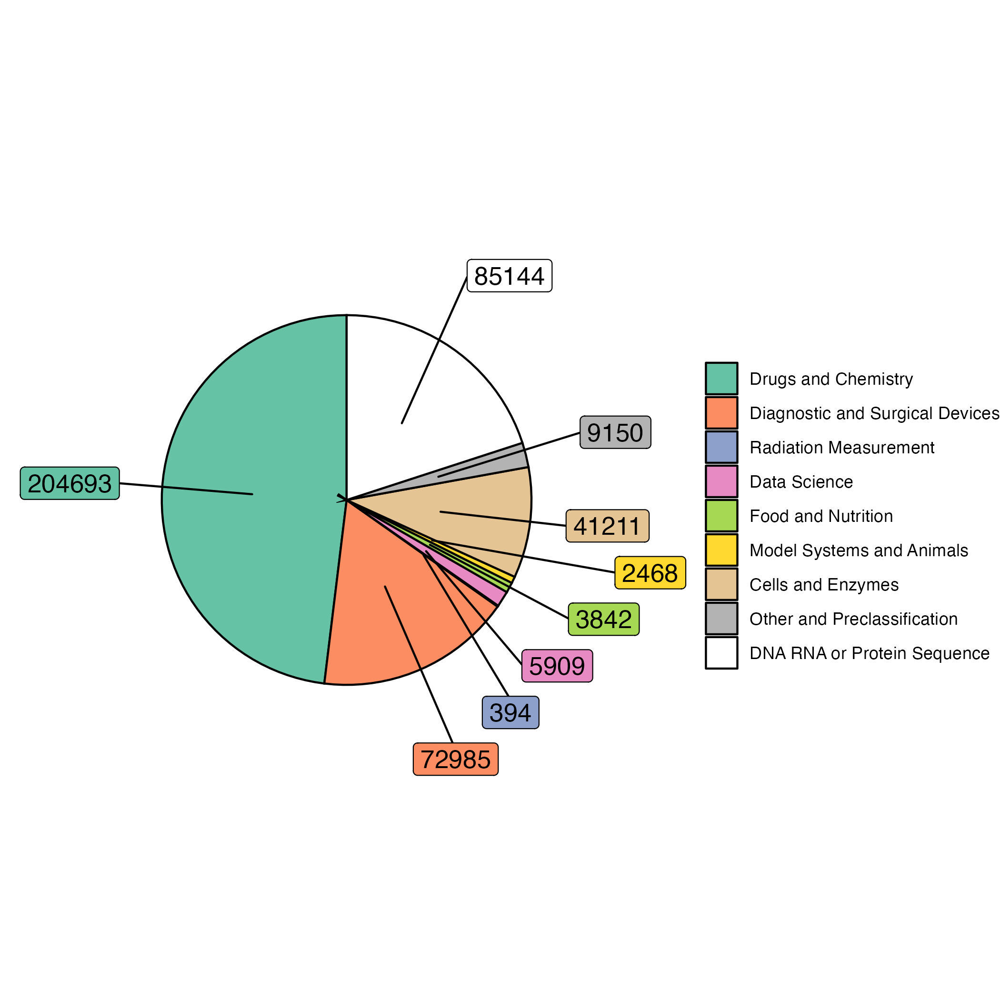
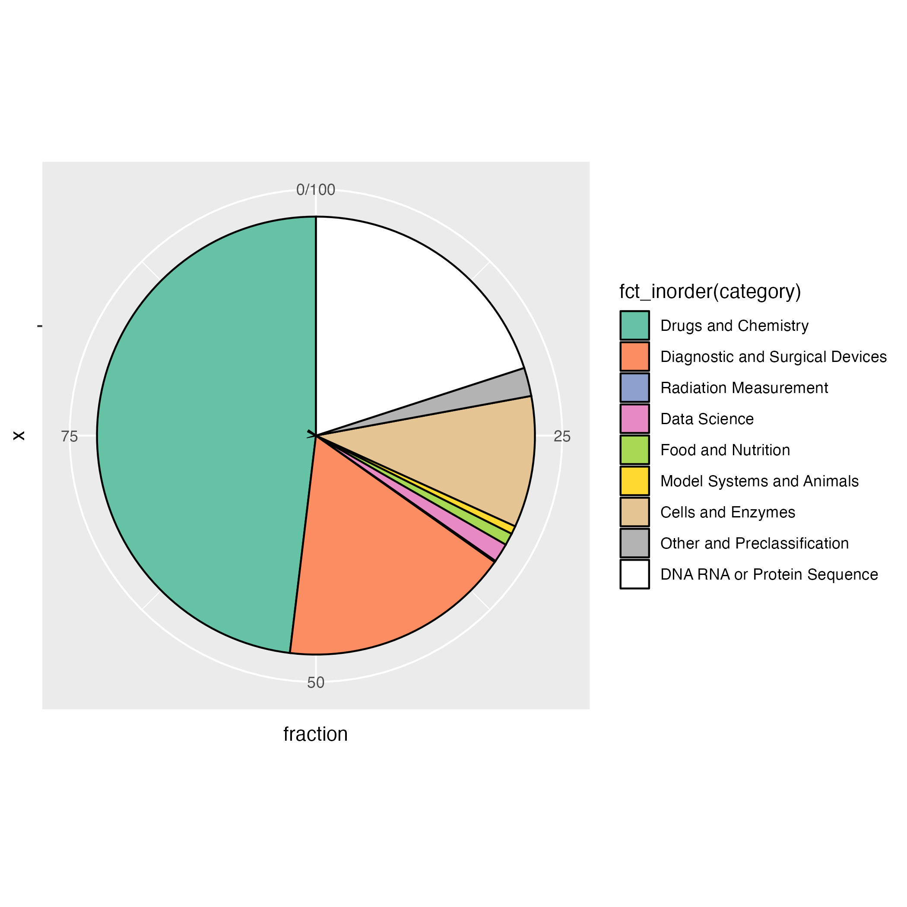
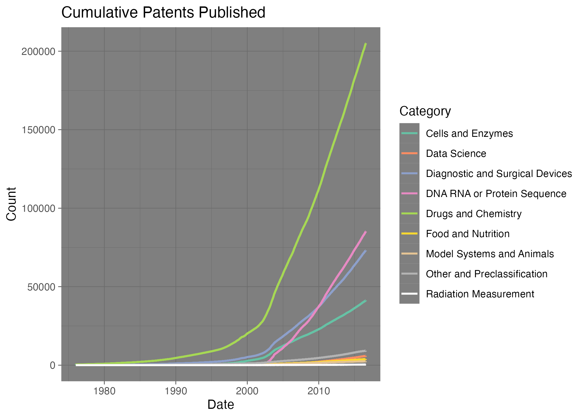
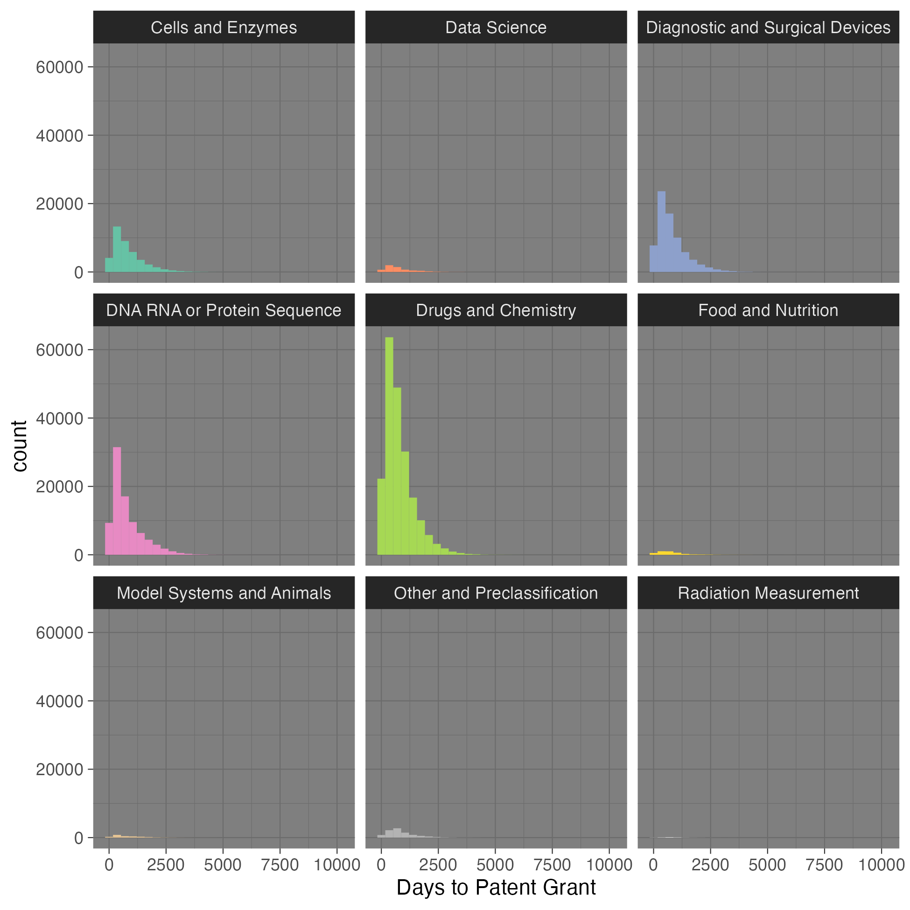
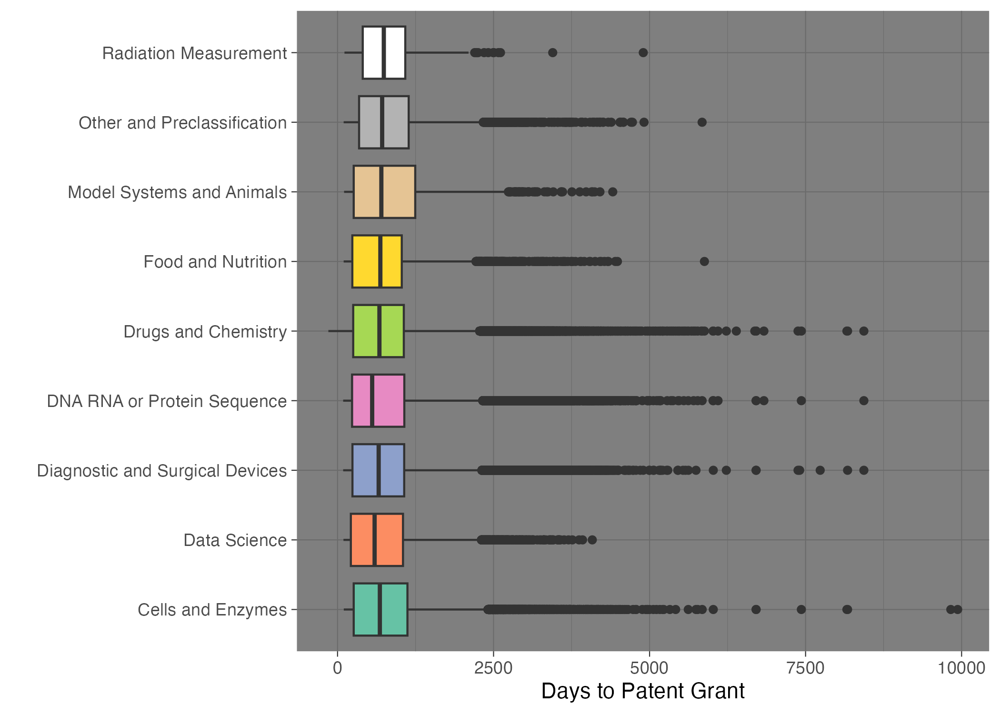

# Cancer Moonshot Patent Data
 <font size="4"> 
Data visualization for the [Cancer Moonshot Patent Data](https://www.uspto.gov/ip-policy/economic-research/research-datasets/cancer-moonshot-patent-data) published in 2016. The data include 270,000 cancer-related patents published between 1976 and 2016. 
</font>

## Summary of patent categories
```{=html}

```
```{=html}

```
## Patents published over time
```{=html}

```
```{=html}

```
## Histograms of patent submission to publication time

```{=html}

```
## Boxplot of patent submission to publication time

```{=html}

```
